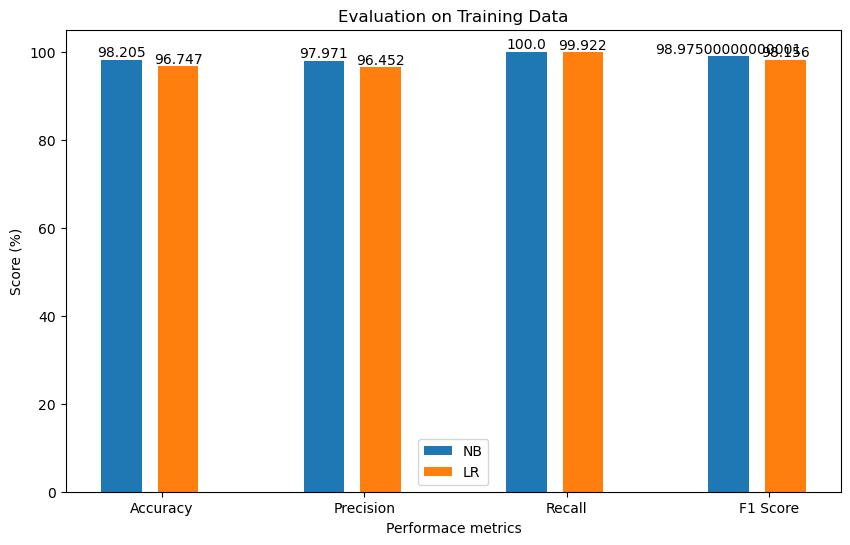
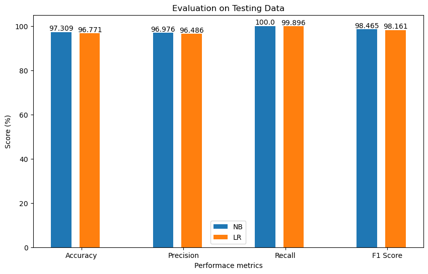

# Spam-Mail-Prediction

This project implement a machine learning-based strategy for spam mail prediction that uses Naive Bayes and Logistic Regression classifiers.  The Term Frequency-Inverse Document Frequency (TF-IDF) approach is used for feature extraction, converting email content into numerical features that accurately reflect the value of terms in the sample.  A comparative comparison of the two models reveals that the Naive Bayes classifier beats Logistic Regression in terms of prediction accuracy.  The Naive Bayes model outperforms Logistic Regression due to its probabilistic nature and efficiency in text categorization tasks, with greater accuracy recorded.

## Prerequisite Library

There are some needed Libraries for this project to work. They are 

- numpy
- pandas
- sklearn
- matplotlib
- seaborn

> **Installation of numpy Library**
```bash
pip install numpy
```
> **Installation of pandas Library**
```bash
pip install pandas

```
> **Installation of scikit learn Library**
```bash
pip install -U scikit-learn
```
> **Installation of matplotlib Library**
```bash
pip install matplotlib
```
# Methodology


# Implementation
Following library are used for traing, testing and evaluating the overal projects:

```bash
## For data manupulation

panda
numpy


## For Visualization

matplotlib
seaborn

## For Performance Measures
accuracy_score 
precision_score  
recall_score  
f1_score 
confusion_matrix 

## For Model traning and  Teting
train_test_split 
MultinomialNB
LogisticRegression


```

# Result and Analysis
Different results are obtained based on the performance metrics (accuracy, precision, recall, and F1 score).  The results of training and testing with various machine learning algorithms are displayed in the bar graph below.





# Conclusion 
Among the Navie Bayes and Logistic Regression algorithms Navie Baiyes (NB) outperforms LR algorithms, achieving 98.205% and 97.309% accuracy in training and testing respectively.
